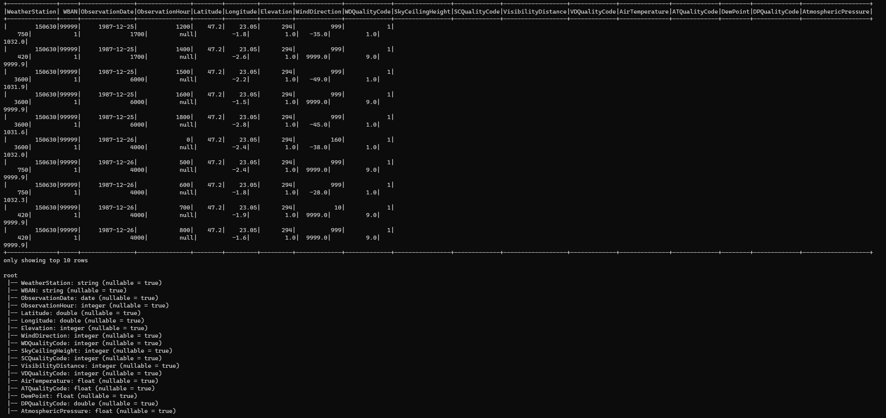
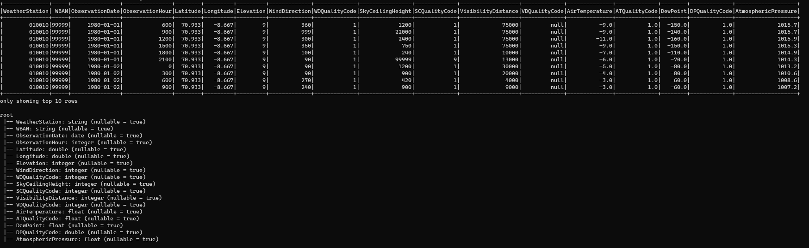
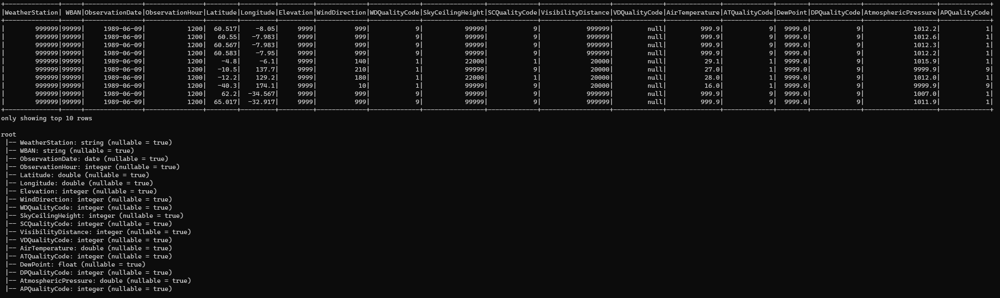
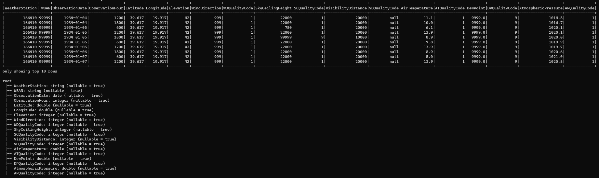
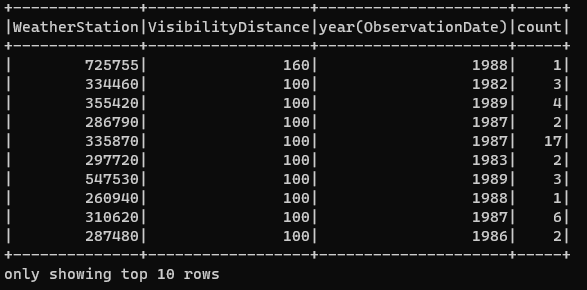
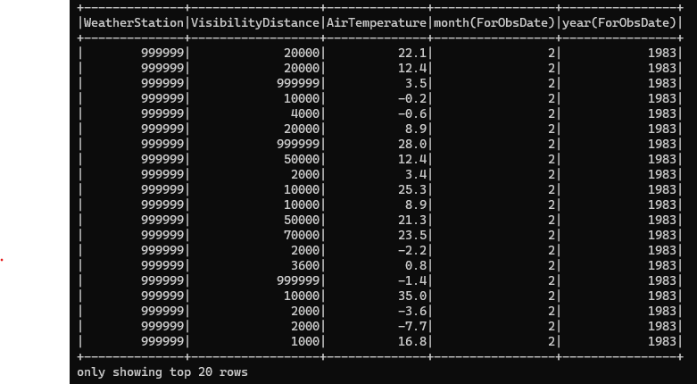
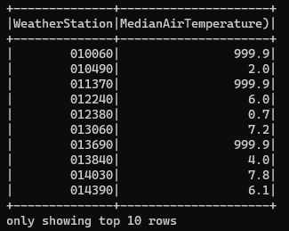
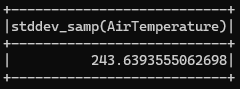
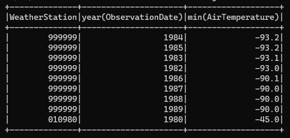
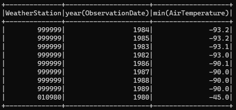

# Final Project

## Part 1
  - Steps to excute part 1
      - Login into spark server using credentials: `ssh -i ~/.ssh/id_ed25519_srajulu-spark-server  srajulu@192.168.172.45`
      - Navigate to the folder `/home/srajulu/srajulu/ITMD-521/Final/part-one`
      - Run these three commands to run `SGR-part-one.py` to convert the file to csv, json, and parquet files:
        - `nohup spark-submit --master spark://192.168.172.23:7077 --packages "org.apache.hadoop:hadoop-aws:3.2.2" --driver-memory 10G --executor-memory 12G --executor-cores 6 SGR-part-one.py 80.txt 80.csv csv &`

        - `nohup spark-submit --master spark://192.168.172.23:7077 --packages "org.apache.hadoop:hadoop-aws:3.2.2" --driver-memory 10G --executor-memory 12G --executor-cores 6 SGR-part-one.py 80.txt 80.parquet parquet &`

        - `nohup spark-submit --master spark://192.168.172.23:7077 --packages "org.apache.hadoop:hadoop-aws:3.2.2" --driver-memory 10G --executor-memory 12G --executor-cores 6 SGR-part-one.py 80.txt 80.json json &`
      
      - Run this command to run the `lz4comp.py`
        -  `nohup spark-submit --master spark://192.168.172.23:7077 --packages "org.apache.hadoop:hadoop-aws:3.2.2" --driver-memory 10G --executor-memory 10G --executor-cores 6 lz4comp.py 80.txt 80.csv.lz4 csv > lz4.log &`
      
      

      
## Part 2
  - Navigate to the folder `/home/srajulu/srajulu/ITMD-521/Final/part-two`

  - Command: `spark-submit --master spark://192.168.172.23:7077 --packages "org.apache.hadoop:hadoop-aws:3.2.2" --driver-memory 10G --executor-memory 2G --executor-cores 6 csv-read-part-two.py`
  - CSV 

  - Command: `spark-submit --master spark://192.168.172.23:7077 --packages "org.apache.hadoop:hadoop-aws:3.2.2" --driver-memory 10G --executor-memory 2G --executor-cores 6 json-read-part-two.py`
  - JSON 

  - Command: `spark-submit --master spark://192.168.172.23:7077 --packages "org.apache.hadoop:hadoop-aws:3.2.2" --driver-memory 10G --executor-memory 2G --executor-cores 6 parquet-read-part-two.py`
  - Parquet 

  - Command:  `nohup spark-submit --master spark://192.168.172.23:7077 --packages "org.apache.hadoop:hadoop-aws:3.2.2" --jars /opt/spark/jars/mysql-connector-java-8.0.28.jar --driver-memory 8G --executor-memory 2G --executor-cores 6 Mariadb.py > SurajMariaDBlog.log &`
  - MariaDB 

## Part 3
* First run
  * `--driver-memory 2G --executor-memory 4G --executor-cores 1 --total-executor-cores 20`
  * Expectation: The total number of cores from all executors is set to 20, each executor has to allocate 1 core, driver memory to 2G, and per executor memory to 4G. The performance of the application is high when we have limited number of cores and enough to process the application
  * Results/runtime: `7 min`
  * Command : `spark-submit --master spark://192.168.172.23:7077 --packages "org.apache.hadoop:hadoop-aws:3.2.2" --driver-memory 2G --executor-memory 4G --executor-cores 1 --total-executor-cores 20 part-three.py`
  * 

* Second run
  * `--driver-memory 10G --executor-memory 12G --executor-cores 2`
  * Expectation: Each executor has to allocate 2 cores, and 12G of memory per executor. The performance of the application is based on the memory per executor and there's no limit on the total number of cores. The data processing speed is faster compared to the first run.
  * Results/runtime: `10 min`
  * Command : `spark-submit --master spark://192.168.172.23:7077 --packages "org.apache.hadoop:hadoop-aws:3.2.2" --driver-memory 10G --executor-memory 12G --executor-cores 2 part-three.py`
  * 

* Third run
  * `--driver-memory 4G --executor-memory 4G --executor-cores 2 --total-executor-cores 40`
  * Expectation: Fach executor with 2 cores and total number of cores from all executors is set to 40. The performance of the application is comparatively slower than the other two as increasing the number of fora cores with lower memorv will decrease the processing sneed
  * Results/runtime: `6 min`
  * Command : `spark-submit --master spark://192.168.172.23:7077 --packages "org.apache.hadoop:hadoop-aws:3.2.2" --driver-memory 4G --executor-memory 4G --executor-cores 2 --total-executor-cores 40 part-three.py`
  * 

## Part 4

  - Command: `spark-submit --master spark://192.168.172.23:7077 --packages "org.apache.hadoop:hadoop-aws:3.2.2" --driver-memory 2G --executor-memory 4G --executor-cores 1 --total-executor-cores 20 part-four.py`
  - Query 1:
  - Output : 

  - Query 2:
  - Output : 

  - Query 3:
  - Output : 

  - Query 4:
  - Output : 

  - Query 5:
  - Output : 

  - Query 6:
  - Output : 

