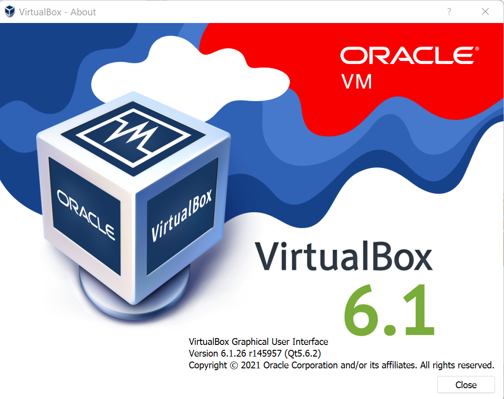

# Infrastructure Assignment

## Add Ignore File to Your Git Repo

Git includes a method to tell you local (and remote) repo to ignore certain files inside of a repo.  This is a useful security feature so that passwords and other credentials won't accidentally be committed to your remote repo.  To do this lets create a file named: `.gitignore` in the root of your local repository.

Inside that file place these values:

* .DS_Store
* packer-cache
* packer_cache
* \*.box
* build/
* output\*/
* \~
* .vmdk
* .ovf
* .vagrant/\*

## Install VirtualBox

If you do not already have VirtualBox 6.x installed, use the package manager to install VirtualBox.  Take a screenshot of the VirtualBox > Help > About VirtualBox output. You can use Chocolatey and Homebrew to install VirtualBox on MacOS and Windows.


## Install Vagrant

Using a package manager, install the latest version of [Vagrant](https://vagrantup.com "Vagrant download site").  If you have a version 2.2.x you will be ok.  Note, if on Linux, do not use the built in package manager as these versions of Vagrant and Packer are too old and unmaintained.  Place a screenshot of the output of the command: ```vagrant --version```


Complete the Vagrant tutorial located at [https://learn.hashicorp.com/collections/vagrant/getting-started](https://learn.hashicorp.com/collections/vagrant/getting-started "Vagrant tutorial"), you can skip the INSTALL section as we are installing using a package manager and skip the SHARE ENVIRONMENT section.  

After completing this tutorial take a screenshot of the output of the command ```vagrant box list```


## Install Packer.io

Using a package manager, install the latest version of [Packer](https://packer.io "Packer install site").  If you have a version > 1.6.x you will be ok. Note, if on Linux, do not use the built in package manager as these versions of Vagrant and Packer are too old and unmaintained.  Place a screenshot of the output of the command: ```packer --version```


I have a series of samples that I use from Packer to build images.  Clone this sample repo to your computer: ```git clone https://github.com/illinoistech-itm/jhajek```.  If you have previously clone this repo - `cd` into your local repository and issue this command: `git pull`.  You only need to clone once, then to update issue the `git pull` command.  Navigate to the ```packer-example-code``` directory from the command line.  Issue the command: ```packer build .```

Take a screenshot of the output of the ```build``` directory showing the ```*.box``` file.


## Initialize the Built Artifact

Now that you have built your own machine image or artifact.  We need to initialize it so that you can run your images with Vagrant.

### First Step

Lets `cd` to the build directory where the \*.box file is located (the output of your Packer build command) and add this \*.box file to Vagrant for management.  Issue the command: ```vagrant box add ./ubuntu-20042-live-server*.box```

### Second Step

In the ```build``` directory, create a directory named **ubuntu-focal-2001-vanilla**.  Lets ```cd``` into that directory and issue the command: ```vagrant init ubuntu-focal-2001-vanilla```.

### Third Step

To start the VM lets type the same command: ```vagrant up```.  Upon the vm starting succesfully, let us type the commmand: ```vagrant ssh``` to connect to the instance we built via SSH.

***Deliverable*** Complete all of the software installs and take the required screenshots.  Add them to this template document and push this to your private repo > itmo-544 > week-02
