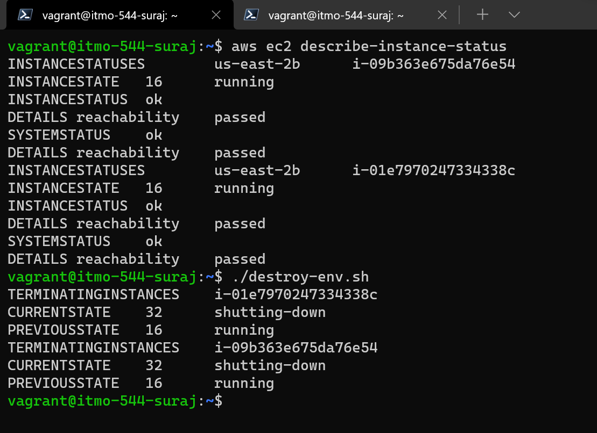

# Week-06 Lab

## Objectives

* Create and Deploy a single-tier cloud application (section 4.1)
* Implement a dynamic command positional parameter solution in your shell scripts
* Create scripts to dynamically launch, install, and destroy your environment
* Understand how to use AWS CLI Filters for querying ephemeral instance data

## Outcomes

At the conclusion of this Lab you will have successfully deployed and destroyed a single-tier cloud application via the AWS CLI and using positional parameters in a shell script.  You will have configured your application to use AWS CLI Filters and Queries to retrieve dynamic data about ephemeral instances.

 

## Assumptions

For this assignment you can make these assumptions

* The I we are all using us-east-2 as our default region
* That the access keys are already created and not needed in this script
* That the security-group has been already created and all of the proper ports are open

## Deliverable

Create a folder named: week-06 under your class folder in the provided private repo. In the folder there will be three shell scripts:

* A script named: `create-env.sh`
  * This script will create an EC2 instance that installs an Apache Web Server on launch
* A script named: `install-env.sh` will install the Apache 2 webserver
* A script named: `destroy-env.sh`
  * This script will terminate all infrastructure you have created

### create-env.sh

This is shell script will take commandline input dynamically via positional parameters ($1 $2 $3 and so on) via a file named `arguments.txt`.  For a refresh on positional parameters [see my text book](https://github.com/jhajek/Linux-text-book-part-1/releases/tag/2021-09-29 "Link to Linux Textbook") starting on page 179 PDF.

```./install-env.sh $(<arguments.txt)```

### arguments.txt

This is where you will pass the arguments (space delimited) as follows (order is **very** important)

* image-id
* instance-type
* count
* subnet-id
* key-name
* security-group-ids
* user-data

I will grade your logic by running it with my account configuration information, no hard-coded values.

### install-env.sh

This will contain the same content as last week's assignment:

```bash
#!/bin/bash

sudo apt-get update
sudo apt-get install -y apache2
# Or if you would like to do nginx you can do that 
# sudo apt-get install y nginx
```

### destroy-env.sh

Using AWS CLI v2 filters filter the instance you created and destroy it.  A single running of `destroy-env.sh` will terminate all of the resources that your `install-env.sh` script launched.

[AWS Filters](https://docs.aws.amazon.com/cli/latest/userguide/cli-usage-filter.html "URL for AWS Filters")

## Final Deliverable

Submit the URL to the week-06 folder to Blackboard.  Your week-06 repo will contain all three shell scripts but not the **arguments.txt** file.
