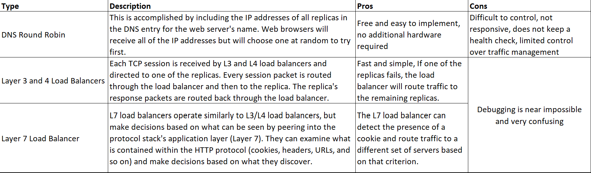

# Exercises - Chapter 04 Application Architecture

1. Describe the single-machine, three-tier, and four-tier web application architectures.
* A single-machine is a single self-contained machine which will provide the service, it receives and process requests/queries over HTTP protocol. This type of architecture is good when the target audience is less in number, ideal for small websites or web apps. The single machine is it's own bottle neck, as there is only one machine chances of single point failure are more, and is not scalable.
*   The three-tier web service pattern is made up of three layers: a load balancer layer, a web server layer, and a data service layer. The web servers all rely on the same backend data server, which is usually a SQL database. Requests are routed to the load balancer before entering the system. The load balancer selects one of the middle layer machines and routes the request to that web server. The web server processes the request, possibly with the assistance of a database query. The load balancer generates and sends back the response.
* When there are numerous individual applications sharing a common frontend infrastructure, a four-tier web service is used. In this pattern, web requests are routed to the load balancer, which distributes traffic to the various frontends as usual. The frontends handle user interactions and communicate with the application servers for content. In the final layer, application servers access shared data sources.

2. Describe how a single-machine web server, which uses a database to generate content, might evolve to a three-tier web server. How would this be done with minimal downtime?
* A single-machine web server might become overwhelmed with queries and difficult to maintain when there is a high volume of traffic, it would be appropriate to use a three-tier architecture. This could be achieved using any monitoring tool and auto scaling group, and have configure pre warm instances ready to be provisioned.

3. Describe the common web service architectures, in order from smallest to largest.
* The common web service architectures are:
    * Single-tier
    * Three-tier
    * Four-tier
    * Cloud tier

4. Describe how different local load balancer types work and what their pros and cons are. You may choose to make a comparison chart.
* 

5. What is “shared state” and how is it maintained between replicas?
* In shared state the information that the user has logged in as well as the user's profile information are stored in a location that all backends can access. The user's state is retrieved from this shared area for each HTTP connection. It makes no difference if each HTTP request is routed to a different machine with this method. The user is not prompted to log in each time the backends are changed.

6. What are the services that a four-tier architecture provides in the first tier?
* First tier of four-tier architecture is frontend and it's services are:
    * All cookie processing, session pipelining, compression, and encryption are handled by the frontends.
    * Frontend software can keep track of the ever-changing HTTP protocol definition, relieving application servers of this burden.
    * Frontends handle everything related to users logging in and out.
    * In this pattern, web requests come in as usual to the load balancer, which divides the traffic among the various frontends.

7. What does a reverse proxy do? When is it needed?
* A reverse proxy allows one web server to transparently serve content from another web server. The user perceives a single cohesive web site, despite the fact that it is made up of a patchwork of applications. Requests are routed to the reverse proxy, which parses the URL and retrieves the necessary pages from the appropriate server or service. This outcome is then communicated to the original requester.

8. Suppose you wanted to build a simple image-sharing web site. How would you design it if the site was intended to serve people in one region of the world? How would you then expand it to work globally?
* We can use a three-tier architecture, have all the instances placed in an auto scaling group, use GLB and have replicas placed where most of the target audience is located.

9. What is a message bus architecture and how might one be used?
* A message bus is a mechanism for many-to-many communication between servers. It is a convenient method of distributing information among various services. This method is more efficient than polling a database repeatedly to check for new information's arrival. A publisher is a server that sends messages, and subscribers are those who receive them. It supports one-to-many, many-to-many, and many-to-one communication modes. A message bus system is efficient because clients only receive messages if they are subscribed to it.

10. What is an SOA?
* SOA is Service-Oriented Architecture used to manage large services. Here a subsystem is treated as a entire service which will be available to be consumed via an API.

11. Why are SOAs loosely coupled?
* SOAs are loosely coupled for of beneficial reasons, they provide a high level of abstraction, the services become easy to improve or replace incase of failure.

12. Who was Christopher Alexander and what was his contribution to architecture?
* Christopher Alexander is an emeritus professor at the University of California, Berkeley and a widely influential British-American architect and design theorist. His theories on the nature of human-centered design have had an impact on fields other than architecture, such as urban design, software, sociology, and others. As an architect and general contractor, Alexander has designed and built over 100 buildings. Alexander's work is used by a variety of contemporary architectural communities of practice, including the New Urbanist movement, to help people reclaim control over their own built environment. However, Alexander is unpopular among some mainstream architects and critics, owing to the fact that his work is frequently harshly critical of much of contemporary architectural theory and practice.
