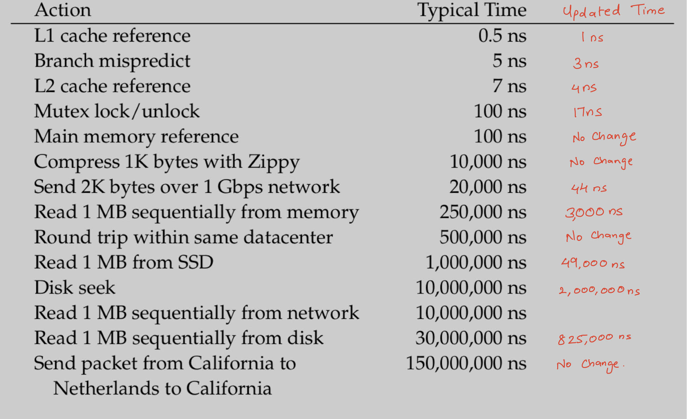

# Exercises - Chapter 05 Application Architecture

1. What is scaling?
* Scaling in easier term refer to increase in size, scaling in distributed system is to increase the system hardware configuration either in better performing euipments or in numbers. Scaling a system is done to meet the traffic requirements.

2. What are the options for scaling a service that is CPU bound?
* Scaling up or Vertical Scaling, either of the option can be used to meet desired level of performance, when scaling up  as the traffic grows or reduces according to time or events to meet the performance level.

3. What are the options for scaling a service whose storage requirements are growing?
* Selecting a scaling method depends on the scenario, the service can be scaled in one or in a combination of x, y, and z axes of the AFK cube, or might simply scale up if it would staisfy the number of users using the service. For example the service can be scaled in x axis if the content is audio, video, etc, i.e static content. The service can be scaled in y axis in combination with x axis for scaling and to serve a larger number of users.

4. The data in Figure 1.10 is outdated because hardware tends to get less expensive every year. Update the chart for the current year. Which items changed the least? Which changed the most?
* Changed least:
    - Main memory reference
    - Compress 1K bytes with Zippy
    - Round trip within same datacenter
    - Round trip from california to Netherlands
    
* Changed most:
    - L1 cache reference
    - Branch mispredict
    - L2 cache reference
    - Mutex lock/unlock
    - Send 2K bytes over 1 Gbps network
    - Read 1 MB sequentially from memory
    - Read 1 MB from SSD
    - Disk seek
    - Read 1 MB from sequentially from disk.

5. Rewrite the data in Figure 1.10 in terms of proportion. If reading from main memory took 1 second, how long would the other operations take? For extra credit, draw your answer to resemble a calendar or the solar system.
* 

6. Take the data table in Figure 1.10 and add a column that identifies the cost of each item. Scale the costs to the same unit—for example, the cost of 1 terabyte of RAM, 1 terabyte of disk, and 1 terabyte of L1 cache. Add another column that shows the ratio of performance to cost.
*  This question is quite confusing, I'll be attempting this later.

7. What is the theoretical model that describes the different kinds of scaling techniques?
* The AFK Scaling Cube - Methodologies for scaling to massive proportions can be divided into three categories: replicating the entire system, splitting the system into individual functions, services, or resources, and splitting the system into individual chunks.
    * Horizontal Scaling(Scaling out): 
    * Functional or Service splits: 
    * Lookup-oriented split:

8. How do you know when scaling is needed?
* Scaling is needed when:
    * When the system begins to lag
    * Users start complaining about the system/service being slow
    * Increased latency 
    * When performance of the system/service degrades when compared to perviously measured metrics.
    * When the system/service needs to serve a larger audience.
    * For special events when more traffic is expected.

9. What are the most common scaling techniques and how do they work? When are they most appropriate to use?
* The most common scaling techniques are:
    * Scaling up: It is the most simplest form of scaling, it is done by using high performance machines. It should be used when it's certain that it would staisfy the performance needs and meet the traffic requirements.
    * Horizontal Scaling(Scaling out): It is done by replicating a service or entire system on multiple datacenters and/or multiple regions. It is used to better serve the users and increase the throughput.
    * Functional or Service splits: It is done by splitting individual functions or services (similar to SOA, where services are isolated) so that it becomes easy to scale a service by adding/removing additional resources. It's used when we need to categorize and serve differnt types of transactions, user or type of data, differently.
    * Lookup-oriented split: It is achieved by splitting the data into unique segments and providing them with a dedicated resource. It is used when we need to segment the data acorrding to specific criteria like date, goe-location, type of user, etc.

10. Which scaling techniques also improve resiliency?
* Scaling out/scaling on x axis improves resiliency by replicating entire service/system in multiple datacenters or availability zones or regions, when one datacenter fails the system will be able to serve users from datacenters in different availability zones.

11. Research Amdahl’s Law and explain how it relates to the AKF Scaling Cube.
* Amdahl’s Law; it is a formula used to determine the maximum improvement possible by simply improving a single component of a system. It is frequently used in parallel computing to predict the theoretical speedup when multiple processors are used. It relates to AFK on the y axis by isolating services and to scale accordingly.
